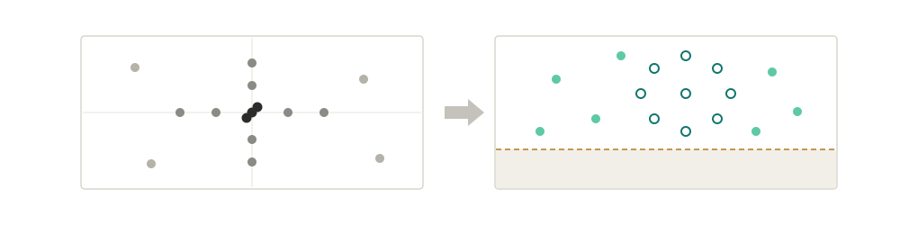
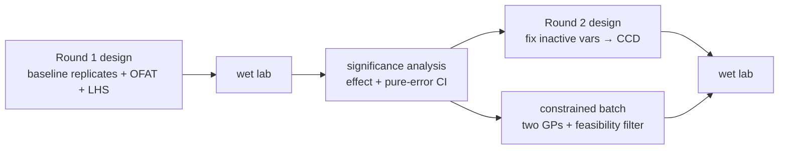
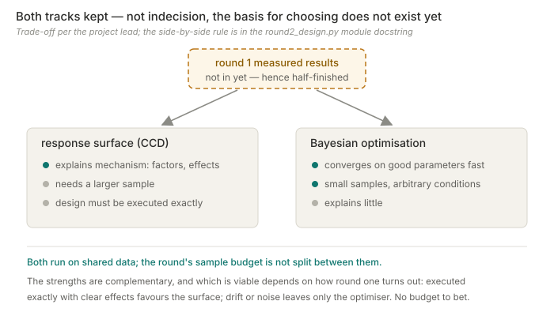
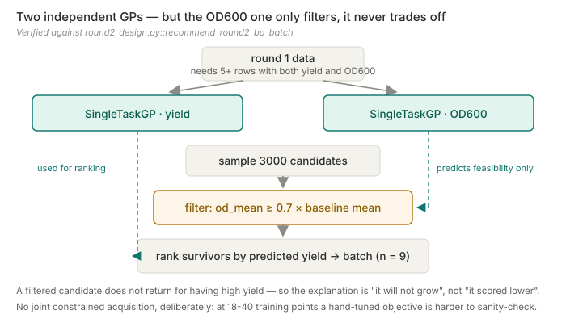

<div align="center">

# ExperimentAdvisor

### Which few flasks to run next — and how little three replicates actually buy.




[](#status-deliberately-half-finished)
[](#the-constrained-batch-two-gps-one-filter)
[](docs/adr/README.md)
[](tests)

[The loop](#the-loop) · [Why both tracks](#why-both-tracks-exist) · [Method notes](#method-notes) · [Quick start](#quick-start) · [Tech stack](#tech-stack) · [Boundaries](#boundaries)

[**English**](README.md) · [中文](README.zh.md)

</div>

---

> Plans a screening round of shake-flask experiments, reads back what the results actually say,
> and designs the second round from that — with confidence intervals wide enough to be honest about
> how little data three replicates buy.

Small-sample design, not data mining. That constraint decides almost every choice below.

## Status: deliberately half-finished

The first round of real results is not in yet. That is not unfinished code — a system like this
only pays off against real data, and the honest state is "mechanism complete, waiting on the bench".

It got here by a route worth knowing. The original plan used historical *E. coli* fermenter data,
and a full Bayesian pipeline was built on it. That data turned out to be **unidentifiable rather
than merely sparse**: the strain kept changing across a long time span, and the yield gap between
optimised and initial strains dwarfed any process effect — so condition effects could not be
separated out, and more of that data would only have estimated a confounded quantity more
precisely. (A trip to the factory for more of it ended with the machine reinstalled and the data
gone.) The project moved to shake-flask work designed from scratch, where the strain is fixed and
the conditions are set by the design sheet. See [ADR-0003](docs/adr/0003-legacy-ecoli-fermenter-path-retained-as-reference.md).

## The loop



**Round 1** ([`recommendation/round1_design.py`](experiment_advisor/recommendation/round1_design.py))
combines three independently switchable blocks: replicates at a known-working `BASELINE`,
one-factor-at-a-time sweeps at protocol-derived `OFAT_LEVELS`, and a Latin hypercube fill —
3 replicates + 11 OFAT rows + 4 joint rows. The baseline replicates are not padding; they are the
only source of a variance estimate.

**Round 2** ([`recommendation/round2_design.py`](experiment_advisor/recommendation/round2_design.py))
ranks factor effects, pins the ones that did not move the outcome, and builds a face-centered
central composite design over at most three active variables.

## Why both tracks exist



Classical response-surface refinement and constrained Bayesian optimisation both run, on shared
data, and the round's sample budget is not split between them. That is not indecision — **the basis
for choosing does not exist yet**. Their strengths are complementary and which one is viable
depends on what round one turns out to look like. At this sample size there is no budget to spend
deciding which approach wins before seeing any data.

## Method notes

### The constrained batch: two GPs, one filter



[`recommend_round2_bo_batch`](experiment_advisor/recommendation/round2_design.py) fits **two
independent `SingleTaskGP`s** — one for yield, one for OD600 — samples 3000 candidates, filters on
predicted OD600 against a floor of `0.7 × baseline OD600 mean`, and ranks the survivors by predicted
yield.

**Two models, but still not two objectives.** The OD600 model predicts *feasibility*; a filtered
candidate does not come back for having high yield. So the explanation downstream is "this point
will not grow", not "this point scored lower after weighting" — and no invented weight has to be
defended.

There is deliberately **no joint constrained acquisition function**. The docstring gives the reason
and the trigger to revisit: at 18–40 training points a hand-tuned `ConstrainedMCObjective` is harder
to sanity-check than "fit two GPs, filter, rank", and a filter is explainable to people who do not
do Bayesian optimisation.

> [`optimizer/standard_bo.py`](experiment_advisor/optimizer/standard_bo.py) is a *different*
> implementation — one GP plus `qLogNoisyExpectedImprovement` — and it serves only the legacy
> *E. coli* page. Whether the two merge is an open decision. It is easy to read the wrong one as
> the current path.

### Confidence intervals come from pure error, and they are wide on purpose

Round 1 has one observation per non-baseline level, so per-level variance cannot be estimated.
Standard DOE practice applies: assume the baseline replicates' variance holds across the design
space — that is *why* the center point is replicated rather than every treatment. A single
observation minus the baseline mean has variance `sd² × (1 + 1/n)`, with a t critical value at
`n − 1` degrees of freedom. With three replicates that is df = 2 and the interval is broad.
**That width is the finding**, not a defect to narrow with a friendlier formula.

Fewer than two baseline replicates raises rather than falling back to an assumed noise level.

### Levels come from the protocol, not from the variable bounds

Using global min/max as DOE levels produces design points nobody can actually run
([ADR-0007](docs/adr/0007-round1-variable-set-and-ccd-boundary-rules.md)). And when an optimum sits
against a hard bound, `generate_ccd` shifts the whole sampling band inward rather than clipping one
side — one-sided clipping silently degrades a symmetric design into an asymmetric one, which is the
kind of bug that produces a plausible answer. The shift itself is silent by design;
`resolve_round2_variables` is what tells a human it happened.

### Two of the six variables are not continuous

Temperature has three incubator settings and feed interval has two slots. Round 1's OFAT rows
already test **every** level of both, so round 2 never refines them further — it only fixes each at
whichever tested level scored best. Fitting a response surface over three possible values would be
interpolating points the equipment cannot produce.

## Engineering decisions

Every ADR below names the regression test that guards it. That pairing is the point: a decision with
no failing condition is a preference.

**The recommender converged to one method, and the rejected seven are asserted absent**
([ADR-0004](docs/adr/0004-standard-recommender-converges-on-gp-qnei.md)).
`standard_bo_ei`, `standard_bo_ucb`, `xgp_bo_ei`, `xgp_bo_ucb`, `conservative_ensemble`,
`random_safe`, `single_xgboost` — all removed;
`tests/test_recommender_comparison.py` asserts each name does **not** appear in results. The root
cause was a change of problem, not of taste: once the work moved from mining historical fermenter
data to designing small-sample experiments from scratch, XGBoost-class methods no longer had the
sample size they need. Reintroducing one requires a superseding ADR, **not an edit to the test**.

**Soft-filter failures grow the pool; they never backfill**
([ADR-0006](docs/adr/0006-soft-filter-failures-grow-pool-not-backfill.md)).
When too few recommendations survive nearest-neighbour / boundary-risk / plausible-range filtering,
the system generates a **larger candidate pool** rather than topping up with candidates that failed
the filter. Backfilling would let rejected points into the final list and make the filter
decorative. Guarded by `tests/test_app_helpers.py::test_soft_filter_uses_larger_pool_instead_of_supplementing_failures`.

**Fermentation data never enters version control**
([ADR-0002](docs/adr/0002-fermentation-data-stays-out-of-version-control.md)).
`data/` is gitignored down to template and directory markers; generated reports stay ignored too.
Reproducibility rests on code, templates and tests — the data itself is handed over separately by
its owner. Changing that boundary requires a new ADR.

## Quick start

```bash
git clone https://github.com/77652189/ExperimentAdvisor.git
cd ExperimentAdvisor
pip install -r requirements.txt
```

```powershell
python -m streamlit run App/app.py
```

CPU is fine — the models are small by construction, because the sample size is.

```bash
python -m pytest tests/     # 55 tests
```

## Tech stack

| Layer | Choice | Why this one |
| --- | --- | --- |
| Surrogate model | BoTorch `SingleTaskGP` on GPyTorch | Gaussian processes give calibrated uncertainty at 18–40 points, where tree ensembles have nothing to learn from ([ADR-0004](docs/adr/0004-standard-recommender-converges-on-gp-qnei.md)) |
| Constraint handling | Predict-and-filter, **not** a joint acquisition | At this sample size a filter is both easier to sanity-check and explainable to the people running the experiments |
| Statistics | SciPy `stats.t` over replicate pure error | The design has one observation per level, so the interval has to come from the replicated center point — and it stays wide |
| Design generation | Face-centered CCD + Latin hypercube | Classical DOE where the design can be executed exactly; LHS to fill the joint space cheaply |
| Diagnostics | scikit-learn + leave-one-out GP CV | Shown to the user as model-trust information, not used as a gate |
| UI | Streamlit + Plotly | Single-team internal tool; knobs are exposed rather than tuned away |
| Tests | pytest | 55 tests, several of which guard **decisions** rather than behaviour |

## Boundaries

- **Six variables, shake flask, one target.** Not a general fermentation optimizer.
- **No yield prediction, no claim of optimal conditions.** The output is "run these points next".
- **Round 1 must land before Round 2 means anything** — the significance step needs at least five
  complete rows with both yield and OD600.
- **The legacy *E. coli* fermenter path is reference only**
  ([ADR-0003](docs/adr/0003-legacy-ecoli-fermenter-path-retained-as-reference.md)); its historical
  HMO/2FL data is void and `App/pages_legacy_ecoli.py` is kept for UI comparison, not for use.
- **Recommendations are candidates, not decisions.** The OD600 fraction, the pool multiplier and the
  active-variable cap are all human-set knobs, exposed rather than tuned away. The `0.7` is labelled
  in code as an engineering default for the R&D team to confirm or override.

## Documentation

| Document | Changes when |
| --- | --- |
| [Requirements](docs/REQUIREMENTS.md) | the goal or capability boundary changes |
| [Architecture](docs/ARCHITECTURE.md) | the implementation structure changes |
| [Execution plan](docs/EXECUTION_PLAN.md) | progress moves — sole authority on status |
| [Handoff](docs/HANDOFF.md) | the active slice changes |
| [ADR index](docs/adr/README.md) | never — decisions are superseded, not edited |

---

<div align="center">

More work at [my personal site](https://77652189.github.io).

</div>
