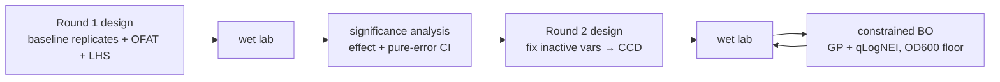

# ExperimentAdvisor — Two-Round Experimental Design & Feedback

[English](README.md) · [中文](README.zh.md)

> Plans a screening round of shake-flask experiments, reads back what the results actually say,
> and designs the second round from that — with confidence intervals wide enough to be honest about
> how little data three replicates buy.

Small-sample design, not data mining. That constraint decides almost every choice below.

---

## The loop



**Round 1** ([`recommendation/round1_design.py`](experiment_advisor/recommendation/round1_design.py))
combines three independently switchable blocks: replicates at a known-working `BASELINE`,
one-factor-at-a-time sweeps at protocol-derived `OFAT_LEVELS`, and a Latin hypercube fill. The
baseline replicates are not padding — they are the only source of a variance estimate.

**Round 2** ([`recommendation/round2_design.py`](experiment_advisor/recommendation/round2_design.py))
ranks factor effects, pins the ones that did not move the outcome, and builds a central composite
design over at most three active variables.

**Optimization** ([`optimizer/standard_bo.py`](experiment_advisor/optimizer/standard_bo.py)) fits a
BoTorch `SingleTaskGP` to yield and picks a batch with `qLogNoisyExpectedImprovement`.

## Method notes

**One GP, one floor — not two objectives.** Yield is modeled. Growth is not: OD600 enters as a
hard feasibility floor at `0.7 × baseline OD600 mean`
([`od600_threshold`](experiment_advisor/recommendation/round2_design.py)). Weighting yield and
growth into one score would have let the optimizer trade away viable growth for a yield number,
and the weight would have been an invented parameter nobody could defend. A floor derived from a
run that actually worked is defensible, and the fraction is labelled an engineering default for the
R&D team to override.

**Confidence intervals come from pure error, and they are wide on purpose.** Round 1 has one
observation per non-baseline level, so per-level variance cannot be estimated. Standard DOE practice
applies: assume the baseline replicates' variance holds across the design space — that is *why* the
center point is replicated rather than every treatment. A single observation minus the baseline mean
has variance `sd² × (1 + 1/n)`, with a t critical value at `n − 1` degrees of freedom. With three
replicates that is df = 2 and the interval is broad. **That width is the finding**, not a defect to
narrow with a friendlier formula.

**Levels come from the protocol, not from the variable bounds.** Using global min/max as DOE levels
produces design points nobody can actually run
([ADR-0007](docs/adr/0007-round1-variable-set-and-ccd-boundary-rules.md)). And when an optimum sits
against a hard bound, `generate_ccd` shifts the whole sampling band inward rather than clipping one
side — one-sided clipping silently degrades a symmetric design into an asymmetric one, which is the
kind of bug that produces a plausible answer.

## Engineering decisions

Every ADR below names the regression test that guards it. That pairing is the point: a decision with
no failing condition is a preference.

**The recommender converged to one method, and the rejected seven are asserted absent**
([ADR-0004](docs/adr/0004-standard-recommender-converges-on-gp-qnei.md)).
`standard_bo_ei`, `standard_bo_ucb`, `xgp_bo_ei`, `xgp_bo_ucb`, `conservative_ensemble`,
`random_safe`, `single_xgboost` — all removed;
`tests/test_recommender_comparison.py` asserts each name does **not** appear in results. The root
cause was a change of problem, not of taste: once the work moved from mining historical *E. coli*
fermenter data to designing small-sample experiments from scratch, XGBoost-class methods no longer
had the sample size they need.

**Soft-filter failures grow the pool; they never backfill**
([ADR-0006](docs/adr/0006-soft-filter-failures-grow-pool-not-backfill.md)).
When too few recommendations survive nearest-neighbour / boundary-risk / plausible-range filtering,
the system generates a **larger candidate pool** rather than topping up with candidates that failed
the filter. Backfilling would let rejected points into the final list and make the filter
decorative. Guarded by `tests/test_app_helpers.py::test_soft_filter_uses_larger_pool_instead_of_supplementing_failures`.

**Fermentation data never enters version control**
([ADR-0002](docs/adr/0002-fermentation-data-stays-out-of-version-control.md)).
`data/` is gitignored down to template and directory markers; generated reports stay ignored too.
Reproducibility rests on code, templates and tests — the data itself is handed over separately by
its owner. Changing that boundary requires a new ADR.

## Quick start

```powershell
pip install -r requirements.txt
python -m streamlit run App/app.py
```

Needs BoTorch / GPyTorch / PyTorch (CPU is fine), pandas, scikit-learn, Streamlit and Plotly.

## Boundaries

- **Six variables, shake flask, one target.** Not a general fermentation optimizer.
- **Round 1 must land before Round 2 means anything** — the significance step needs at least five
  complete rows with both yield and OD600.
- **The legacy *E. coli* fermenter path is reference only**
  ([ADR-0003](docs/adr/0003-legacy-ecoli-fermenter-path-retained-as-reference.md)); its historical
  HMO/2FL data is void and `App/pages_legacy_ecoli.py` is kept for UI comparison, not for use.
- **Recommendations are candidates, not decisions.** The OD600 fraction, the pool multiplier and the
  active-variable cap are all human-set knobs, exposed rather than tuned away.

## Documentation

| Document | Changes when |
| --- | --- |
| [Requirements](docs/REQUIREMENTS.md) | the goal or capability boundary changes |
| [Architecture](docs/ARCHITECTURE.md) | the implementation structure changes |
| [Execution plan](docs/EXECUTION_PLAN.md) | progress moves — sole authority on status |
| [Handoff](docs/HANDOFF.md) | the active slice changes |
| [ADR index](docs/adr/README.md) | never — decisions are superseded, not edited |

---

> More work at [my personal site](https://77652189.github.io).
