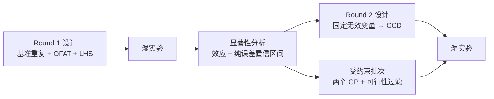
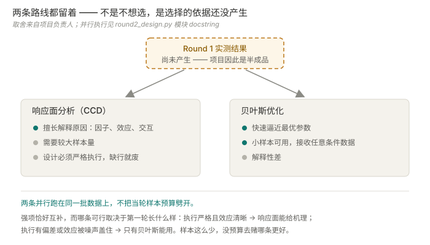
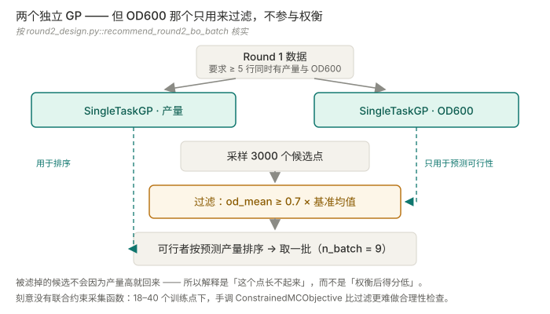

<div align="center">

# ExperimentAdvisor

### 下一批该做哪几个瓶 —— 以及三个重复到底买得到多少信息。


[](#状态刻意的半成品)
[](#受约束批次两个-gp一道过滤)
[](docs/adr/README.md)
[](tests)

[闭环](#闭环) · [为什么两条路线都留](#为什么两条路线都留着) · [方法要点](#方法要点) · [快速开始](#快速开始) · [技术栈](#技术栈) · [边界](#边界)

[English](README.md) · [**中文**](README.zh.md)

</div>

---

> 规划一轮摇瓶筛选实验，读回结果**实际说明了什么**，再据此设计第二轮——
> 置信区间宽到足以诚实反映"三个重复其实买不到多少信息"。

**小样本设计，不是数据挖掘。** 这个约束几乎决定了下面每一个选择。

## 状态：刻意的半成品

**第一批真实结果还没出来。** 这不是代码没写完——这类系统的价值本来就得等真实数据才能兑现，
诚实的状态是"机制完整，等台面上的实验"。

它走到这里的路径值得知道。最初的方案用的是历史大肠杆菌发酵罐数据，并且**在那上面完整跑通过
一套贝叶斯流程**。但那批数据后来判定为**不可识别，而不只是稀疏**：菌种在很长的时间跨度里
一直在变，优化菌种与初始菌种的产量差**远大于任何工艺效应**——条件效应无法被分离出来，
再多同类数据也只是把一个被混杂的量估得更精确。（还去工厂出差找过更多，那台机器重装系统后
数据没了。）项目因此转向从零设计的摇瓶实验：菌种固定、条件由设计表规定。
见 [ADR-0003](docs/adr/0003-legacy-ecoli-fermenter-path-retained-as-reference.md)。

## 闭环



**Round 1**（[`recommendation/round1_design.py`](experiment_advisor/recommendation/round1_design.py)）
由三个可独立开关的块组成：在已知可行的 `BASELINE` 上做重复、按协议推导的 `OFAT_LEVELS`
做单因素扫描、再用拉丁超立方填充——**3 个重复 + 11 行 OFAT + 4 行联合**。
基准重复不是凑数，它们是**方差估计的唯一来源**。

**Round 2**（[`recommendation/round2_design.py`](experiment_advisor/recommendation/round2_design.py)）
对因子效应排序，把没有推动结果的变量钉住，并在最多三个活跃变量上构建面心中心复合设计。

## 为什么两条路线都留着



经典响应面细化与受约束贝叶斯优化**都在跑，且跑在同一批数据上**，不把当轮样本预算劈开。

这不是犹豫不决——**是选择的依据还没产生**。两者强项恰好互补，而哪一条可行**取决于第一轮
实测长什么样**。在这个样本量下，没有预算可以花在"还没见到数据就先赌哪条更好"上。

## 方法要点

### 受约束批次：两个 GP，一道过滤



[`recommend_round2_bo_batch`](experiment_advisor/recommendation/round2_design.py) 拟合
**两个独立的 `SingleTaskGP`**——一个给产量，一个给 OD600——采样 3000 个候选点，
用 OD600 预测值对 `0.7 × 基准 OD600 均值` 的下界做过滤，可行者再按预测产量排序。

**两个模型，但仍然不是两个目标。** OD600 那个模型预测的是**可行性**；
被滤掉的候选不会因为产量高就回来。所以下游的解释是"这个点长不起来"，
而不是"这个点加权之后得分较低"——**也就不需要为一个凭空发明的权重辩护**。

并且**刻意没有联合约束采集函数**。docstring 给了理由和重做的触发条件：
在 18–40 个训练点的规模下，手工调的 `ConstrainedMCObjective` 比"拟合两个 GP、过滤、排序"
**更难做合理性检查**，而过滤对不做贝叶斯优化的人是可解释的。

> [`optimizer/standard_bo.py`](experiment_advisor/optimizer/standard_bo.py) 是**另一套**实现——
> 单个 GP 加 `qLogNoisyExpectedImprovement`——它**只服务 legacy 大肠杆菌页面**。
> 两者是否合并是一条待决策项。读代码时很容易把它误当成当前路径。

### 置信区间来自纯误差，而且宽是故意的

Round 1 在每个非基准档位上只有一次观测，因此无法估计逐档方差。这里用的是标准 DOE 做法：
假设基准重复的方差在设计空间上成立——**这正是"重复中心点而不是重复每个处理"的原因**。
单次观测减去基准均值的方差是 `sd² × (1 + 1/n)`，t 临界值取 `n − 1` 自由度。
三个重复即 df = 2，区间自然很宽。**这个宽度本身就是结论**，不是一个该用更友好的公式去收窄的缺陷。

基准重复少于 2 个时**直接抛错**，而不是退回一个假设的噪声水平。

### 档位来自实验协议，不是变量边界

拿全局最小/最大值当 DOE 档位，会产出没人能真的执行的设计点
（[ADR-0007](docs/adr/0007-round1-variable-set-and-ccd-boundary-rules.md)）。
而当最优点贴着硬边界时，`generate_ccd` **把整个采样带向内平移**，而不是把一侧裁掉——
单侧裁剪会悄悄把一个对称设计降级成不对称的，**这类 bug 会产出一个看起来合理的答案**。
平移本身是静默的，由 `resolve_round2_variables` 负责告诉人这件事发生了。

### 六个变量里有两个不是连续的

温度只有三个培养箱档位，补料间隔只有两个时间槽。Round 1 的 OFAT 行已经把两者的**每个档位**
都测过，所以 Round 2 不再细化它们——只把各自钉在实测最优的那个档上。
在只有三个可能取值的变量上拟合响应面，是在插值设备根本产生不了的点。

## 工程决策

下面每条 ADR 都点名了守卫它的回归测试。**这个配对本身就是要点：一条没有失败条件的决策只是偏好。**

**推荐方法收敛为一种，被否的七种被断言不存在**
（[ADR-0004](docs/adr/0004-standard-recommender-converges-on-gp-qnei.md)）。
`standard_bo_ei`、`standard_bo_ucb`、`xgp_bo_ei`、`xgp_bo_ucb`、`conservative_ensemble`、
`random_safe`、`single_xgboost` 全部移除；`tests/test_recommender_comparison.py`
逐一断言这些名字**不出现**在结果中。根因是**问题变了，不是口味变了**：
一旦工作从"挖历史发酵罐数据"转为"从零设计小样本实验"，XGBoost 这类方法就失去了它们需要的样本量。
要重新引入，需要一条取代性的 ADR，**而不是改一行测试**。

**软过滤未通过时扩大候选池，绝不递补**
（[ADR-0006](docs/adr/0006-soft-filter-failures-grow-pool-not-backfill.md)）。
当通过最近邻 / 边界风险 / 合理范围过滤的推荐数量不足时，系统生成**更大的候选池**，
而不是拿未通过过滤的候选补上。递补会让被拒的点进入最终列表，使过滤沦为摆设。
守卫：`tests/test_app_helpers.py::test_soft_filter_uses_larger_pool_instead_of_supplementing_failures`。

**发酵数据永不进入版本控制**
（[ADR-0002](docs/adr/0002-fermentation-data-stays-out-of-version-control.md)）。
`data/` 除模板与目录标记外全部 gitignore，生成的报告同样忽略。
可复现性建立在代码、模板与测试上——数据本身由其所有者单独交接。改动这条边界需要新开 ADR。

## 快速开始

```bash
git clone https://github.com/77652189/ExperimentAdvisor.git
cd ExperimentAdvisor
pip install -r requirements.txt
```

```powershell
python -m streamlit run App/app.py
```

CPU 足够——模型天生就小，因为样本量就那么大。

```bash
python -m pytest tests/     # 55 个测试
```

## 技术栈

| 层 | 选型 | 为什么是它 |
| --- | --- | --- |
| 代理模型 | BoTorch `SingleTaskGP`（基于 GPyTorch） | 高斯过程在 18–40 个点上仍能给出**标定过的不确定性**，而树集成在这个量级根本学不到东西（[ADR-0004](docs/adr/0004-standard-recommender-converges-on-gp-qnei.md)） |
| 约束处理 | 预测 + 过滤，**不用**联合采集函数 | 这个样本量下，过滤既更容易做合理性检查，**也能向真正做实验的人解释清楚** |
| 统计 | SciPy `stats.t` + 重复纯误差 | 设计上每档只有一次观测，区间只能来自被重复的中心点——而且它就该是宽的 |
| 设计生成 | 面心 CCD + 拉丁超立方 | 设计能被严格执行时用经典 DOE；LHS 用来低成本填充联合空间 |
| 诊断 | scikit-learn + 留一 GP 交叉验证 | 作为模型可信度信息展示给用户，**不作为门槛** |
| 界面 | Streamlit + Plotly | 单团队内部工具；旋钮**暴露出来**而不是替用户调好 |
| 测试 | pytest | 55 个测试，其中几条守卫的是**决策**而不是行为 |

## 边界

- **六个变量、摇瓶、单一目标。** 不是通用发酵优化器。
- **不预测产量，不声称找到最优条件。** 产出是"下一批做这几个点"。
- **Round 1 不落地，Round 2 没有意义**——显著性步骤要求至少 5 行同时有产量与 OD600 的完整数据。
- **legacy 大肠杆菌发酵罐路径仅作参考**
  （[ADR-0003](docs/adr/0003-legacy-ecoli-fermenter-path-retained-as-reference.md)）；
  其历史 HMO/2FL 数据已作废，`App/pages_legacy_ecoli.py` 保留用于界面对照，不用于实际推荐。
- **推荐是候选，不是决策。** OD600 比例、候选池倍数、活跃变量上限都是**人来设的旋钮**，
  暴露而非替用户调好。代码里把 `0.7` 明确标注为**工程默认值**，供研发团队确认或覆盖。

## 文档

| 文档 | 什么时候改 |
| --- | --- |
| [需求](docs/REQUIREMENTS.md) | 目标或能力边界变了 |
| [架构](docs/ARCHITECTURE.md) | 实现结构变了 |
| [执行计划](docs/EXECUTION_PLAN.md) | 进度推进了——状态的唯一权威 |
| [handoff](docs/HANDOFF.md) | 当前切片换了 |
| [ADR 索引](docs/adr/README.md) | 从不改——决策只被取代，不被改写 |

---

<div align="center">

更多项目见[个人网站](https://77652189.github.io)。

</div>
