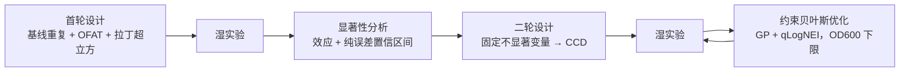

# ExperimentAdvisor 两轮实验设计与反馈

[English](README.md) · [中文](README.zh.md)

> 设计一轮摇瓶筛选实验，把结果真正说了什么读回来，再据此设计第二轮——
> 置信区间宽到足以诚实地承认：三次重复能买到的信息就这么多。

小样本设计，不是数据挖掘。这条约束几乎决定了下面每一个选择。

---

## 闭环



**首轮**（[`recommendation/round1_design.py`](experiment_advisor/recommendation/round1_design.py)）
由三个可独立开关的模块拼成：在已知可行的 `BASELINE` 上做重复、
按协议给出的 `OFAT_LEVELS` 做单因素扫描、再用拉丁超立方补空。
基线重复不是凑数——它是**唯一**的方差来源。

**二轮**（[`recommendation/round2_design.py`](experiment_advisor/recommendation/round2_design.py)）
给因素效应排序，把没推动结果的变量钉死，
在至多三个活跃变量上建中心复合设计（CCD）。

**优化**（[`optimizer/standard_bo.py`](experiment_advisor/optimizer/standard_bo.py)）
用 BoTorch `SingleTaskGP` 拟合产量，以 `qLogNoisyExpectedImprovement` 选一批点。

## 方法要点

**一个 GP，一条下限——不是两个目标。** 建模的是产量。生长不建模：
OD600 以硬可行性下限的形式进来，取值 `基线 OD600 均值 × 0.7`
（[`od600_threshold`](experiment_advisor/recommendation/round2_design.py)）。
如果把产量和生长加权成一个分数，优化器就可以拿"能长起来"去换一个产量数字，
而那个权重会是一个谁也辩护不了的臆造参数。
从一次真的跑通过的实验里导出的下限是能辩护的，
而且那个 0.7 被明确标注为工程默认值，研发组可以推翻。

**置信区间来自纯误差，而且宽是故意的。** 首轮在非基线水平上每格只有一个观测，
没法各自估方差。标准 DOE 做法是：假设基线重复的方差在整个设计空间成立——
这正是**只重复中心点、而不是重复每个处理**的理由。
单个观测减去基线均值的方差是 `sd² × (1 + 1/n)`，t 临界值取 `n − 1` 自由度。
三次重复意味着 df = 2，区间会很宽。
**这个宽度本身就是结论**，不是一个该用更友善的公式收窄掉的缺陷。

**水平取自协议，不取自变量上下界。** 拿全局 min/max 当 DOE 水平，
会产出没人真能执行的设计点
（[ADR-0007](docs/adr/0007-round1-variable-set-and-ccd-boundary-rules.md)）。
而当最优值贴在硬边界上时，`generate_ccd` 把整条采样带**整体内移**，而不是裁掉一侧——
单侧裁剪会悄悄把对称设计降级成不对称设计，
这类 bug 的特征恰恰是：它会给出一个看起来很合理的答案。

## 工程要点

下面每条 ADR 都点名了守护它的回归测试。这个配对本身就是要点：
一条没有失败条件的决策，只是偏好。

**推荐器收敛到一种方法，被否掉的七种由测试断言其不存在**
（[ADR-0004](docs/adr/0004-standard-recommender-converges-on-gp-qnei.md)）。
`standard_bo_ei`、`standard_bo_ucb`、`xgp_bo_ei`、`xgp_bo_ucb`、`conservative_ensemble`、
`random_safe`、`single_xgboost` 全部移除；
`tests/test_recommender_comparison.py` 对这七个名字逐一断言**不出现**在结果中。
根因是问题换了，不是口味换了：
一旦工作从"挖历史大肠杆菌发酵罐数据"转成"从零设计小样本实验"，
XGBoost 这类方法就再也拿不到它们需要的样本量。

**软过滤不通过时扩大候选池，绝不递补**
（[ADR-0006](docs/adr/0006-soft-filter-failures-grow-pool-not-backfill.md)）。
当通过最近邻距离 / 边界风险 / 历史合理范围筛选的推荐不够数时，
系统生成一个**更大的候选池**，而不是拿没通过过滤的候选来凑。
递补会让被拒的点进入最终名单，把过滤器变成装饰。
守卫是 `tests/test_app_helpers.py::test_soft_filter_uses_larger_pool_instead_of_supplementing_failures`。

**发酵数据永不进入版本控制**
（[ADR-0002](docs/adr/0002-fermentation-data-stays-out-of-version-control.md)）。
`data/` 被 gitignore 到只剩模板与目录标记，生成的报告也保持忽略。
可复现性靠代码、模板和测试撑着——数据本身由所有者另行保管和交接。
要改这条边界，必须先新开一条 ADR。

## 快速开始

```powershell
pip install -r requirements.txt
python -m streamlit run App/app.py
```

需要 BoTorch / GPyTorch / PyTorch（CPU 即可）、pandas、scikit-learn、Streamlit 与 Plotly。

## 边界

- **六个变量、摇瓶、单一目标蛋白。** 不是通用发酵优化器。
- **首轮数据到位之前，二轮没有意义**——显著性分析至少需要五行同时有产量和 OD600 的完整数据。
- **legacy 大肠杆菌发酵罐路径只作参考**
  （[ADR-0003](docs/adr/0003-legacy-ecoli-fermenter-path-retained-as-reference.md)）；
  其历史 HMO/2FL 数据已作废，`App/pages_legacy_ecoli.py` 留作界面对照，不投入使用。
- **推荐是候选，不是决定。** OD600 的分数、候选池倍数、活跃变量上限
  全是人设的旋钮，摆在明面上而不是调没了。

## 文档

| 文档 | 什么时候改 |
| --- | --- |
| [需求](docs/REQUIREMENTS.md) | 目标或能力边界变了 |
| [架构](docs/ARCHITECTURE.md) | 实现结构变了 |
| [执行计划](docs/EXECUTION_PLAN.md) | 进度推进了——状态的唯一权威 |
| [handoff](docs/HANDOFF.md) | 当前切片换了 |
| [ADR 索引](docs/adr/README.md) | 从不改——决策只被取代，不被改写 |

---

> 更多项目见[个人网站](https://77652189.github.io)。
